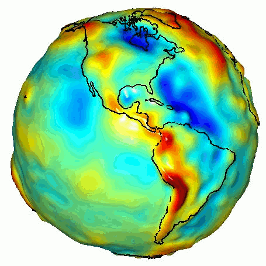

# 课程主页

本课程主要介绍计算地球物理的基本方法和工具，旨在让学生掌握基本的计算地球物理方法，能够采用有限差分来实现波动方程、扩散方程的数值模拟，并对计算结果进行分析。同时，本课程注重学生的动手能力，要求学生能够随堂进行基本的Jupyter Notebook文字化编程。

本课程主要介绍有限差分和伪谱法等数值求解方法，并分别介绍椭圆型、抛物型和双曲型偏微分方程的数值计算方法。此外，本课程还将简单介绍基于OpenMP、MPI和CUDA并行的地球物理高性能计算方法。

本课程将会教学生使用Linux操作系统，并采用Anaconda进行Python环境进行管理，使用Jupyter Notebook作为Python的IDE进行文字化编程，安装并使用Madagascar开源地球物理平台。开源软件和开源研究将贯穿本课程的所有内容，鼓励学生进行开源研究探索。

## 授课人员

- 主讲老师: [汪宇锋](https://yufengwa.github.io) - 答疑方式: 计算地球物理课程微信群 (可提前预约当面答疑 - 物探楼411)
- 助教: 刘学港、肖梦姿

## 课程前期要求

- 了解基本的Python、C语言编程；
- 了解部分Linux操作系统（可在课程中学习）；
- 具备基本的地球物理背景知识。

## 本课程目标

- 了解计算地球物理的基本方法和工具；
- 掌握三种不同类型偏微分方程的数值求解方法；
- 了解地球物理高性能计算的基本方法；
- 简单掌握Linux、Jupyter Notebook、Madagascar、并行服务器等工具。

## 参考资料

- [**Madagascar**](https://reproducibility.org/wiki/Main_Page) is an open-source software package for multidimensional data analysis and reproducible computational experiments.
- [**SeismicUnix**](https://en.wikipedia.org/wiki/Seismic_Unix) is an open source seismic utilities package which was supported by the Center for Wave Phenomena (CWP) at the Colorado School of Mines (CSM). 
- [**CIG**](https://geodynamics.org/cig/) is a community-driven organization that advances Earth science by developing and disseminating software for geophysics and related fields.
- [**COMPUTATIONAL SEISMOLOGY: A PRACTICAL INTRODUCTION**](http://www.computational-seismology.org/) is an introductory text to a range of numerical methods used today to simulate time-dependent processes in Earth science, physics, engineering, and many other fields.
- [**GPGN535**](https://github.com/jshragge/GPGN535) This course develops the principles of geophysical computing in the context of simulating and validating numerical solutions to the types of partial differential equations commonly found in geophysical investigations.
